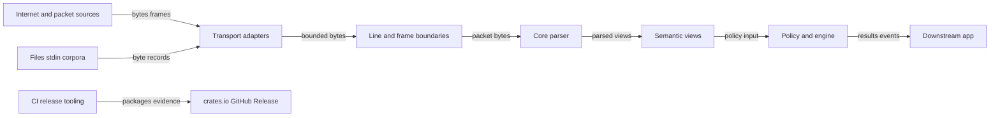

# libaprs-engine Threat Model

## Executive summary

The top risk themes for this workspace are untrusted APRS byte parsing, internet-facing transport adapter misuse by downstream applications, resource exhaustion at read/frame boundaries, semantic confusion from permissive policy or nested third-party packets, sensitive operator data exposure through logs/corpora, and crates.io/GitHub release integrity. The repo already has strong baseline controls: `unsafe` is forbidden in runtime crates, the parser is byte-preserving and fail-closed, default reads and packet/frame sizes are bounded, security and supply-chain CI gates exist, and publishing is guarded by explicit release evidence.

## Scope and assumptions

- In scope: the whole Rust workspace, including `crates/libaprs-engine`, `crates/aprs-cli`, all `crates/aprs-transport-*` adapters, `fuzz/`, `examples/`, `docs/`, `scripts/`, `.github/workflows/`, `deny.toml`, `Cargo.lock`, and `supply-chain/`.
- Runtime scope: parser, semantic views, policy, engine, encoders, service helpers, CLI, and transport helpers for files/stdin, TCP, APRS-IS, KISS, serial, UDP, HTTP bodies, MQTT payloads, AX.25 UI frames, append-only file watch, corpus replay, in-process channels, and async splitting.
- Build/release scope: GitHub Actions, release scripts, dependency policy, SBOM/hash evidence, crates.io publication, and GitHub Release creation.
- Out of scope: downstream application business logic, APRS-IS server infrastructure, broker/server authentication systems, TLS termination, queue implementations, production storage, and deployment-specific authorization not implemented in this repo.
- Assumptions confirmed by the user: model the whole workspace; downstream use can be internet facing; release/publishing and GitHub Actions supply-chain paths are in scope.
- Additional assumptions: public APRS traffic may include precise station/operator location data; downstream internet-facing services may process attacker-supplied packet bytes; consuming applications own TLS, auth, retries, backpressure, rate limits, credentials, and authorization.
- Open questions that would materially change risk ranking: whether a specific downstream deployment is multi-tenant; whether non-public operator data is retained; whether release tags/artifacts are signed and enforced by repository rulesets; whether consumers expose `Policy::permissive()` in production.

## System model

### Primary components

- `libaprs-engine`: core byte-preserving parser, semantic classification, policy, engine orchestration, counters, encoders, service helpers, and line transport. Evidence: `README.md:40`, `docs/architecture.md:20`, `crates/libaprs-engine/src/lib.rs:75`.
- Parser and codec boundary: accepts untrusted `&[u8]`, preserves raw bytes, enforces `MAX_PACKET_LEN`, validates `source>path:payload`, rejects malformed shape, and does not lossy-convert payload bytes. Evidence: `docs/security.md:11`, `docs/security.md:64`, `crates/libaprs-engine/src/lib.rs:80`, `crates/libaprs-engine/src/lib.rs:2609`.
- Policy and engine: applies strict default policy after codec validation, tracks accepted/rejected/malformed counters with saturating arithmetic, and has stable observability events. Evidence: `crates/libaprs-engine/src/lib.rs:524`, `crates/libaprs-engine/src/lib.rs:541`, `crates/libaprs-engine/src/lib.rs:793`.
- CLI: reads files or stdin with bounded byte reads, splits packet lines with `LineTransport`, and supports strict/permissive operation and JSON/text diagnostics. Evidence: `README.md:153`, `crates/aprs-cli/src/main.rs:62`, `crates/aprs-cli/src/main.rs:239`.
- Transport adapters: keep protocol I/O and framing outside the core parser while preserving bytes and exposing bounded helpers. Evidence: `docs/transports.md:5`, `docs/transports.md:20`.
- Release/supply-chain tooling: validates metadata, advisory state, dependency policy, SBOM/hash evidence, fuzz corpus hygiene, docs, packaging, MSRV, and publish preconditions. Evidence: `docs/supply-chain.md:20`, `scripts/verify-release.sh:30`, `scripts/publish-release.sh:32`.

### Data flows and trust boundaries

- External packet source -> transport adapter: APRS bytes, stream frames, datagrams, HTTP bodies, MQTT payloads, AX.25 frames, files, or stdin cross a network/file/process boundary. Channel varies by adapter. Existing guarantees are bounded reads/frame limits in helpers; auth, TLS, broker/session credentials, timeouts, retries, and queue depth are application-owned. Evidence: `docs/security.md:47`, `docs/transports.md:187`.
- Transport adapter -> `LineTransport` or frame decoder: byte buffers are split/framed without UTF-8 conversion. Existing guarantees include packet/frame limits before owned copies for bounded helpers. Evidence: `docs/transports.md:9`, `crates/libaprs-engine/src/transport.rs:141`.
- `LineTransport` or frame decoder -> `parse_packet`: untrusted packet bytes enter the codec as `&[u8]`. Existing guarantees are `MAX_PACKET_LEN`, required separators, non-empty segments, conservative AX.25-like source/path validation, and fail-closed errors. Evidence: `crates/libaprs-engine/src/lib.rs:2536`, `crates/libaprs-engine/src/lib.rs:2623`.
- `parse_packet` -> semantic views: preserved packet bytes become borrowed structured views and APRS semantic variants. Existing guarantees are byte preservation, optional typed decoding, explicit malformed/unsupported semantics, and no repair of invalid codec input. Evidence: `docs/architecture.md:32`, `docs/architecture.md:82`.
- Semantic views -> `Policy` -> `EngineResult`/events: parsed packets are accepted or rejected by policy. Existing guarantees include strict default rejection of malformed/unsupported semantics and long paths, stable reason codes, and capped raw bytes in malformed observability events. Evidence: `docs/security.md:114`, `crates/libaprs-engine/src/lib.rs:806`, `crates/libaprs-engine/src/lib.rs:564`.
- Encoders/service helpers -> downstream transmit/storage/queues: callers use encoded bytes, duplicate windows, rate budgets, and blocklists. Existing guarantees are validation and runtime-neutral helpers; destination selection, authorization, logging, queueing, and transport transmission are caller-owned. Evidence: `docs/security.md:54`, `docs/security.md:58`.
- Developer/CI inputs -> GitHub Actions/release scripts -> crates.io/GitHub Release: source, dependencies, workflows, SBOM/hash evidence, credentials, and release metadata cross build and publication boundaries. Existing guarantees include read-only workflow permissions, audit/deny, supply-chain evidence checks, clean-tree and release-commit checks, and required env attestations. Evidence: `.github/workflows/security.yml:38`, `.github/workflows/supply-chain.yml:44`, `scripts/publish-release.sh:37`.

#### Diagram

## Assets and security objectives

| Asset | Why it matters | Security objective (C/I/A) |
| --- | --- | --- |
| Raw APRS packet bytes | May contain station identifiers, precise location, telemetry, messages, and replay evidence | C/I/A |
| Parser correctness and fail-closed behavior | Downstream systems rely on parsed packet shape and semantic classification for policy and indexing | I/A |
| Transport read/frame limits | Internet-facing consumers can be exposed to high-volume or oversized input | A |
| Strict policy defaults | Production consumers need safe behavior for malformed, unsupported, or long-path packets | I/A |
| Observability events and counters | Operators use stable reason codes and counters to detect malformed input spikes | I/A |
| Fuzz corpus and fixtures | Checked-in corpora are public release evidence and must not leak private operator data | C/I |
| Cargo manifests, lockfiles, SBOMs, and SHA256 evidence | Dependency and artifact integrity affect all downstream users | I |
| Release scripts, GitHub Actions, tags, and crates.io credentials | Compromise can publish malicious packages or misleading releases | C/I |

## Attacker model

### Capabilities

- Remote unauthenticated attacker can send malformed, oversized, high-volume, invalid UTF-8, semantically unusual, or nested APRS packet bytes to an internet-facing downstream service that uses these crates.
- Remote attacker can influence transport-level inputs such as TCP/APRS-IS streams, UDP datagrams, HTTP bodies, MQTT payloads, KISS frames, AX.25 frames, files uploaded for analysis, or corpus-like packet logs where an application exposes those surfaces.
- Malicious or compromised upstream data source can send server comments, q constructs, stale frames, partial records, repeated delimiters, long paths, invalid checksums, or semantic edge cases.
- Supply-chain attacker can attempt dependency confusion, vulnerable/yanked dependency introduction, stale SBOM/hash evidence, workflow changes, poisoned release metadata, or publication from an unverified commit if repository controls fail.
- Insider or compromised maintainer account can attempt to bypass release review, misuse crates.io credentials, or publish from a dirty or incorrect commit.

### Non-capabilities

- Attacker cannot execute arbitrary code inside `libaprs-engine` solely by sending bytes unless a memory-safety or logic flaw exists; runtime crates forbid `unsafe` code. Evidence: `crates/libaprs-engine/src/lib.rs:1`, `crates/aprs-transport-tcp/src/lib.rs:1`.
- Attacker cannot force this repo to provide TLS, user auth, broker authentication, queue bounds, or service authorization because those are explicitly application-owned. Evidence: `docs/security.md:51`, `docs/transports.md:189`.
- Attacker cannot write to GitHub Actions secrets or crates.io credentials through normal packet parsing paths; release credentials are separate build/release assets.
- Attacker cannot make malformed packet shape return a partial parsed packet through the documented codec API; parse errors are fail-closed. Evidence: `docs/security.md:13`, `crates/libaprs-engine/src/lib.rs:2536`.

## Entry points and attack surfaces

| Surface | How reached | Trust boundary | Notes | Evidence (repo path / symbol) |
| --- | --- | --- | --- | --- |
| Core parser | Downstream code calls `parse_packet` or `Engine::process` | Untrusted packet bytes -> codec | Enforces length, separators, non-empty segments, address shape | `crates/libaprs-engine/src/lib.rs:2609` / `parse_packet` |
| Line transport | Files, stdin, stream batches, HTTP bodies split by newline | Untrusted byte batch -> packet lines | `packets_with_limit` rejects overlong packet lines | `crates/libaprs-engine/src/transport.rs:141` / `LineTransport` |
| CLI | `aprs-cli` reads file path or stdin | Operator-controlled path/stdin -> engine | Uses bounded read and strict policy by default; `--permissive` changes risk | `crates/aprs-cli/src/main.rs:62`, `crates/aprs-cli/src/main.rs:239` |
| TCP adapter | Blocking reader or TCP address helper | Remote TCP stream -> packet lines | Default connect/read timeouts and max read size; TLS/auth are external | `crates/aprs-transport-tcp/src/lib.rs:57` / `TcpReadOptions` |
| APRS-IS adapter | Login line, server reader, q construct helper | Profile fields/server lines -> packet lines | Rejects CR/LF/control injection; profile validation is stricter | `crates/aprs-transport-aprs-is/src/lib.rs:29` / `AprsIsLogin::line` |
| KISS adapter | TNC/serial/TCP KISS bytes | Framed bytes -> decoded payload | Rejects invalid escape, unclosed frame, oversized payload | `crates/aprs-transport-kiss/src/lib.rs:74` / `decode_frames_with_limit` |
| HTTP body adapter | Webhook/upload body supplied by downstream web app | HTTP body bytes -> packet lines | Bounded helper exists; raw `read_packet_lines_from_body` assumes trusted/bounded input | `crates/aprs-transport-http/src/lib.rs:21` |
| MQTT adapter | Broker publish payload and topic | MQTT topic/payload -> packet bytes | Payload limit helper exists; auth/session are broker/application-owned | `crates/aprs-transport-mqtt/src/lib.rs:20` |
| AX.25 adapter | Link-layer UI frame bytes | AX.25 frame -> APRS information field | Decoding validates frame shape and bounded frame length | `crates/aprs-transport-ax25/src/lib.rs` / `decode_ax25_ui_frame_with_limit` |
| Third-party nested packets | Caller invokes `ThirdParty::nested_packet` | Encapsulated body -> codec again | Nested body is explicitly reparsed through same codec boundary | `crates/libaprs-engine/src/lib.rs:1601` |
| Service helpers | Downstream duplicate/rate/blocklist composition | Application queue/clock/storage -> policy helpers | Helpers do not own queues, clocks, storage, or network behavior | `docs/security.md:58`, `crates/libaprs-engine/src/service.rs` |
| Fuzz corpus | Developers add corpora/fixtures | Local or production-derived samples -> public repo | Corpus hygiene rejects common artifacts and oversized files | `docs/security.md:150` |
| Security workflow | Push/PR/schedule on dependency-sensitive paths | Repo changes -> advisory/dependency checks | Runs `cargo audit` and `cargo deny check` with read-only contents permission | `.github/workflows/security.yml:38`, `.github/workflows/security.yml:83` |
| Supply-chain workflow | Push/PR/schedule on evidence-sensitive paths | Repo changes -> SBOM/hash verification | Verifies tracked supply-chain evidence | `.github/workflows/supply-chain.yml:77` |
| Publish script | Maintainer runs release publication | Local env/commit/credentials -> crates.io/GitHub Release | Requires explicit confirm, clean review/gates, matching commit, clean tree | `scripts/publish-release.sh:32`, `scripts/publish-release.sh:77` |

## Top abuse paths

1. Attacker goal: degrade availability of an internet-facing APRS ingestion service. Steps: send oversized TCP/APRS-IS/HTTP/MQTT/KISS inputs -> downstream app uses unbounded helper or raises limits too high -> memory/CPU or queue pressure grows -> ingestion latency or service availability is degraded.
2. Attacker goal: bypass downstream safety policy through permissive parsing. Steps: send malformed or unsupported APRS semantics -> consuming app enables `Policy::permissive()` in production -> packet is accepted for indexing/routing -> downstream policy decisions are made on ambiguous data.
3. Attacker goal: confuse parser or policy with nested third-party traffic. Steps: send third-party packet body with nested malformed/edge-case packet -> caller invokes `nested_packet()` without applying the same strict policy and limits to nested results -> downstream records or alerts misclassify packet origin or semantics.
4. Attacker goal: inject APRS-IS control-line content. Steps: attacker controls callsign/software/filter fields -> caller builds login line -> CR/LF or control bytes would alter APRS-IS command framing -> existing `line()`/`profile_line()` validation rejects this, so residual risk is mainly misuse or bypass.
5. Attacker goal: leak sensitive operator data. Steps: production packet bytes with precise locations or messages are logged, added to fuzz corpus, or returned in diagnostics -> public repo/release evidence includes private data -> confidentiality loss for station/operator information.
6. Attacker goal: poison observability. Steps: send high-volume malformed inputs or path-heavy packets -> counters/reason codes spike or logs include misleading data -> operators miss true upstream issue or overwhelm alert channels.
7. Attacker goal: publish malicious or incorrect crates. Steps: modify manifests/workflows/SBOMs or run release from wrong commit -> bypass checks or stale evidence -> compromised crates.io release reaches downstream users.
8. Attacker goal: exploit dependency or release-tool drift. Steps: introduce vulnerable/yanked/wildcard/git dependency or stale advisory state -> security workflow or release gate misses it if skipped -> vulnerable package is published.

## Threat model table

| Threat ID | Threat source | Prerequisites | Threat action | Impact | Impacted assets | Existing controls (evidence) | Gaps | Recommended mitigations | Detection ideas | Likelihood | Impact severity | Priority |
| --- | --- | --- | --- | --- | --- | --- | --- | --- | --- | --- | --- | --- |
| TM-001 | Remote packet sender | Downstream app is internet facing and uses transport helpers or direct parser calls. Attacker can send malformed or edge-case APRS bytes. | Send invalid UTF-8, malformed separators, invalid address bytes, unsupported semantics, or nested third-party payloads to trigger parser/semantic confusion. | Incorrect downstream indexing, policy decisions, alerting, or replay evidence if consumers ignore fail-closed results. | Parser correctness, downstream integrity, raw packet evidence | Fail-closed parse errors, raw byte preservation, explicit malformed/unsupported semantics, strict default policy. Evidence: `docs/security.md:11`, `crates/libaprs-engine/src/lib.rs:806`, `crates/libaprs-engine/src/lib.rs:2536` | Consumers may use `Policy::permissive()` or ignore `EngineResult::Rejected`/`ParseError`. | Document production profiles that require `Policy::strict()` or custom reviewed policy; add examples that handle each `EngineResult`; add regression tests for nested third-party policy handling. | Track `malformed`, `policy_rejected`, semantic kind, and nested third-party parse failures separately. | Medium | High | High |
| TM-002 | Remote high-volume sender | Internet-facing TCP/APRS-IS/HTTP/MQTT/UDP/KISS/AX.25 ingestion exists. Application may raise limits or omit bounded helpers. | Send oversized batches, long lines, large frames, repeated delimiters, or high packet volume to exhaust memory, CPU, queues, or worker threads. | Targeted denial of service against ingestion or downstream processing. | Availability, transport buffers, worker queues | `DEFAULT_TRANSPORT_READ_LIMIT`, `MAX_PACKET_LEN`, `packets_with_limit`, bounded TCP/APRS-IS/KISS/HTTP/MQTT helpers. Evidence: `crates/libaprs-engine/src/transport.rs:5`, `crates/libaprs-engine/src/transport.rs:98`, `crates/aprs-transport-kiss/src/lib.rs:74` | Application owns socket timeouts, cancellation, queue capacity, retries, rate limits, and TLS/auth. | For internet-facing services, require bounded helper APIs, explicit per-source byte limits, queue caps, read deadlines, rate budgets, and rejection telemetry; avoid exposing unbounded convenience helpers to untrusted input. | Alert on `transport.oversized_input`, timeout/error rates, queue saturation, packet rate, read duration, and per-source rejection spikes. | High | Medium | High |
| TM-003 | Remote or local attacker controlling APRS-IS profile fields | Application accepts callsign/software/filter from user or config not fully trusted. | Inject CR/LF/control bytes or malformed filter syntax into APRS-IS login/profile lines. | Connection command injection or unintended APRS-IS filter behavior. | APRS-IS session integrity, credentials/session state | `AprsIsLogin::line` rejects CR/LF/control bytes; `profile_line` validates callsign and filters. Evidence: `crates/aprs-transport-aprs-is/src/lib.rs:29`, `crates/aprs-transport-aprs-is/src/lib.rs:54` | `line()` is less strict than `profile_line`; downstream may build login strings manually. | Prefer `profile_line()` for any user/config-derived fields; add docs warning against manual login string construction; consider examples using `AprsIsFilter::new` exclusively. | Log validation failures by stable error code without logging raw credentials/passcodes. | Low | High | Medium |
| TM-004 | Remote sender or malicious corpus contributor | Production or private packet samples are logged, exported, or added to corpus/fixtures. | Include private station callsigns, precise locations, operator messages, credentials, or incident payloads in public corpora, logs, diagnostics, or release evidence. | Confidentiality loss and unwanted public disclosure. | Raw packet bytes, fuzz corpus, fixtures, logs, release evidence | Corpus hygiene guidance and checks; malformed observability caps raw bytes. Evidence: `docs/security.md:150`, `crates/libaprs-engine/src/lib.rs:564`, `docs/transports.md:204` | Automated checks cannot identify all sensitive APRS/operator data; accepted/rejected events may preserve raw bytes by design. | Add a corpus sanitization checklist to PR template for fixture changes; require review for corpora from production; redact or hash raw bytes in external logs unless replay is explicitly needed. | Monitor PRs touching `fuzz/corpus/` and fixture paths; scan for secrets and high-precision private samples before release. | Medium | Medium | Medium |
| TM-005 | Malicious maintainer, compromised account, or supply-chain attacker | Attacker can alter manifests, workflows, scripts, release evidence, or run publication with credentials. | Publish malicious crates, stale SBOM/hash evidence, wrong release commit, or misleading GitHub Release. | Downstream package compromise and reputational/integrity loss. | Crates.io packages, GitHub Releases, SBOMs, lockfiles, credentials | Security workflow runs audit/deny; supply-chain workflow verifies evidence; publish script requires clean review/gates, matching commit, clean tree, explicit confirmation. Evidence: `.github/workflows/security.yml:83`, `.github/workflows/supply-chain.yml:77`, `scripts/publish-release.sh:37`, `scripts/publish-release.sh:82` | Env var attestations can be set by a maintainer; tag signing/ruleset enforcement is not evidenced in repo files; manual publishing is still possible. | Enforce branch/tag protection and required checks in GitHub rulesets; prefer signed tags/releases; require two-person review for release script/workflow/publishing changes; store crates.io tokens outside repo with least privilege and rotation. | Alert on workflow/script/manifest/SBOM changes, release creation, crates.io publish events, skipped CI attestations, and tag updates. | Medium | High | High |
| TM-006 | Dependency ecosystem attacker | Dependency manifests or lockfiles change, advisory state changes, or release tools are unavailable/skipped. | Introduce vulnerable, yanked, wildcard, unknown-registry, unknown-git, duplicate, or unreviewed-license dependency. | Vulnerable or policy-violating package release. | Dependency graph, lockfiles, release artifacts | `deny.toml` denies yanked crates, wildcard deps, duplicate versions, unknown sources; CI runs audit/deny. Evidence: `deny.toml:1`, `docs/security.md:132`, `.github/workflows/security.yml:88` | `verify-release.sh` skips `cargo-audit`/`cargo-deny` if tools are absent locally; CI path filters may miss non-dependency changes that still affect release context. | Treat missing audit/deny tools as release blockers for official release; require security workflow success on release commit; periodically run scheduled security workflow and review failures. | Track scheduled security workflow results, dependency diffs, advisory database age, and release gate logs. | Medium | Medium | Medium |
| TM-007 | Downstream integrator or remote sender | Downstream app transmits encoded packets or bridges MQTT/UDP/TCP without auth/rate controls. | Abuse packet encoding, MQTT topic matching, or transport bridging to send unauthorized or high-volume outbound packets. | Unauthorized transmission, upstream abuse, or service reputation damage. | Transmit policy, broker/session credentials, external APRS networks | Encoders validate packet shape only; docs state callers own destination selection, authorization, rate limiting, logging, and transmission. Evidence: `docs/security.md:54`, `crates/aprs-transport-mqtt/src/lib.rs:31` | Repo intentionally does not implement authZ or outbound policy. | Provide a production bridge checklist: require authenticated callers, per-destination allowlists, topic allowlists, outbound rate budgets, and audit events before transmission. | Monitor outbound packet rate, denied topic matches, destination changes, and credential use. | Medium | Medium | Medium |
| TM-008 | Remote sender exploiting observability paths | Application logs raw packet bytes or exposes JSON diagnostics from untrusted input. | Send crafted bytes to poison logs, trigger unsafe sink behavior, or expose sensitive raw payloads to dashboards/API consumers. | Detection confusion, alert fatigue, or data exposure. | Observability events, logs, diagnostics, operator dashboards | Stable reason codes, capped raw malformed events, guidance to avoid echoing untrusted bytes into unsafe sinks. Evidence: `docs/security.md:161`, `crates/libaprs-engine/src/lib.rs:732` | Accepted/rejected events preserve raw packets; sink safety is application-owned. | Log structured codes and hashes by default; gate raw-byte replay behind privileged access; escape output for text/JSON sinks; cap per-source error logging. | Alert on high-cardinality log fields, malformed spikes, and raw-byte access/export events. | Medium | Medium | Medium |

## Criticality calibration

- Critical: practical pre-auth RCE or memory corruption in an internet-facing parser path; release-token theft that allows malicious crates.io publication; verified cross-tenant disclosure of private packet archives in a hosted service.
- High: internet-facing parser or transport flaw that reliably causes service outage; policy bypass that accepts malformed/unsupported packets as trusted production data; compromised release workflow that can publish from a wrong commit despite normal review.
- Medium: targeted DoS requiring missing downstream timeouts or queue limits; private packet sample leak through corpus/logging; dependency policy bypass that requires a skipped or unavailable security gate.
- Low: malformed input rejected with expected parse/policy errors; noisy DoS fully capped by documented limits; information disclosure limited to already-public packet metadata with no private retention.

## Focus paths for security review

| Path | Why it matters | Related Threat IDs |
| --- | --- | --- |
| `crates/libaprs-engine/src/lib.rs` | Core codec, semantics, policy, engine results, observability events, and nested third-party parsing live here. | TM-001, TM-008 |
| `crates/libaprs-engine/src/transport.rs` | Shared bounded reads and line splitting are the main resource-exhaustion choke point. | TM-002 |
| `crates/libaprs-engine/src/service.rs` | Duplicate suppression, rate budgets, and blocklists influence production abuse resistance. | TM-002, TM-007 |
| `crates/libaprs-engine/src/encoder.rs` | Encoders validate outbound packet shape but do not own transmission policy. | TM-007 |
| `crates/aprs-cli/src/main.rs` | CLI file/stdin handling and permissive mode are operator-facing entry points. | TM-001, TM-004 |
| `crates/aprs-transport-tcp/src/lib.rs` | Internet-facing stream helper with timeout and read-limit configuration. | TM-002 |
| `crates/aprs-transport-aprs-is/src/lib.rs` | APRS-IS login/profile validation, filter syntax, q-construct diagnostics, and server line handling. | TM-003, TM-001 |
| `crates/aprs-transport-kiss/src/lib.rs` | Frame decoding handles escaping, unclosed frames, and decoded payload limits. | TM-002 |
| `crates/aprs-transport-http/src/lib.rs` | Webhook/upload ingestion helper has bounded and unbounded convenience APIs. | TM-002, TM-008 |
| `crates/aprs-transport-mqtt/src/lib.rs` | MQTT topic matching and payload copy boundaries affect bridge authorization and payload limits. | TM-002, TM-007 |
| `crates/aprs-transport-ax25/src/lib.rs` | Link-layer frame decoding is an untrusted binary-ish boundary before APRS payload extraction. | TM-001, TM-002 |
| `fuzz/fuzz_targets/` | Fuzz targets should continue covering parser, transport, and semantic edge cases. | TM-001, TM-002 |
| `fuzz/corpus/` | Public corpora can leak private station/operator data if not sanitized. | TM-004 |
| `scripts/check-fuzz-corpus.sh` | Enforces corpus hygiene and should evolve with fixture sensitivity rules. | TM-004 |
| `scripts/verify-release.sh` | Local release gate aggregates security, docs, tests, packaging, audit, deny, and fuzz checks. | TM-005, TM-006 |
| `scripts/publish-release.sh` | Publication guard for crates.io and GitHub Release assets. | TM-005 |
| `.github/workflows/security.yml` | Scheduled and path-filtered advisory/dependency policy checks. | TM-006 |
| `.github/workflows/supply-chain.yml` | SBOM/hash evidence verification for supply-chain-sensitive changes. | TM-005, TM-006 |
| `deny.toml` | Dependency source, license, duplicate, wildcard, yanked, and advisory policy. | TM-006 |
| `supply-chain/SHA256SUMS` | Tracked integrity evidence for workflows, manifests, scripts, policy files, and SBOMs. | TM-005 |
| `supply-chain/sbom/` | Per-crate SBOM release evidence. | TM-005, TM-006 |
| `docs/security.md` | Security invariants and operational ownership boundaries for consumers. | TM-001, TM-002, TM-008 |
| `docs/transports.md` | Integration guidance for bounded, byte-preserving transport use. | TM-002, TM-007 |
| `docs/publishing.md` | Manual and scripted release requirements, including review and CI evidence. | TM-005 |

## Quality check

- Covered discovered entry points: parser, line transport, CLI, TCP, APRS-IS, KISS, HTTP, MQTT, AX.25, third-party nested packets, service helpers, fuzz corpus, security workflow, supply-chain workflow, and publish script.
- Covered each trust boundary in at least one threat: external bytes to transports, transports to line/frame boundaries, line/frame boundaries to parser, parser to semantics/policy, events/logging, outbound adapters, and release tooling to registries.
- Separated runtime behavior from CI/build/dev/release behavior.
- Reflected user clarifications: whole workspace is in scope; internet-facing downstream deployments are plausible; release/publishing and GitHub Actions supply-chain paths are in scope.
- Assumptions and open questions are explicit, especially application-owned TLS/auth/rate limits/queues and release ruleset/signing enforcement.
- Recommendations distinguish existing repo controls from application-owned or process-owned mitigations and align with OWASP secure design principles: validate at trust boundaries, fail closed, least privilege, secure logging, supply-chain integrity, and defense in depth.
